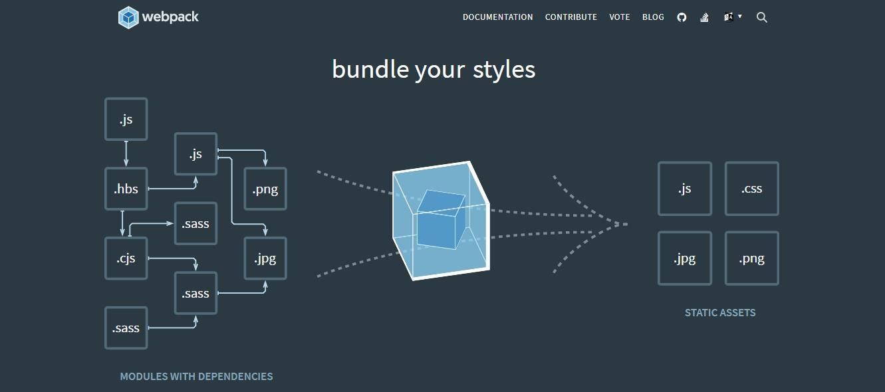

# 从基础到实战 手摸手带你掌握新版Webpack4.0详解

知识点概览：

> Loader，HMR ,Create React App, Caching,
> Plugin, SourceMap,Vue Cli 3.0 ,Shimming,
> WebpackDevServer,TreeShaking, CodeSplitting,
> Babel, React , Library, Eslint ,PWA,
> Vue, Mode,性能优化,多页应用,原理,
> PreLoading, PreFetching ,环境变量,TypeScript

收获：

> 彻底学会Webpack的配置
> 理解 Webpack的作用及原理
> 上手项目的打包过程配置
> 拥有工程化的前端思维
> 步入高级前端工程师行列

## 一：初识Webpack

官网图镇楼：



### 1. 1 什么是WebPack 

**webpack** 是一个现代 JavaScript 应用程序的*静态模块打包工具*：它做的事情是，分析你的项目结构，找到JavaScript模块以及其它的一些浏览器不能直接运行的拓展语言（Scss，TypeScript等），并生成一个或多个 *bundle*，将其打包为合适的格式以供浏览器使用。

**webpack构建：**

> 构建就是把源代码转换成发布到线上的可执行 JavaScrip、CSS、HTML 代码，包括如下内容。

1.代码转换：TypeScript 编译成 JavaScript、SCSS或Less 编译成 CSS 等。

2.文件优化：压缩 JavaScript、CSS、HTML 代码，压缩合并图片等。

3.代码分割：提取多个页面的公共代码、提取首屏不需要执行部分的代码让其异步加载。

4.模块合并：在采用模块化的项目里会有很多个模块和文件，需要构建功能把模块分类合并成一个文件。

5.自动刷新：监听本地源代码的变化，自动重新构建、刷新浏览器,nodemon。

6.代码校验：在代码被提交到仓库前需要校验代码是否符合规范，以及单元测试是否通过。

7.自动发布：更新完代码后，自动构建出线上发布代码并传输给发布系统。

构建其实是工程化、自动化思想在前端开发中的体现，把一系列流程用代码去实现，让代码自动化地执行这一系列复杂的流程。 构建给前端开发注入了更大的活力，解放了我们的生产力,更加方便了我们的开发。

### 1.2  什么是 webpack 模块

- [ES2015 `import`](https://developer.mozilla.org/en-US/docs/Web/JavaScript/Reference/Statements/import) 语句

- [CommonJS](http://www.commonjs.org/specs/modules/1.0/) `require()` 语句

- [AMD](https://github.com/amdjs/amdjs-api/blob/master/AMD.md) `define` 和 `require` 语句

- css/sass/less 文件中的 [`@import` 语句](https://developer.mozilla.org/en-US/docs/Web/CSS/@import)。

- 样式(`url(...)`)或 HTML 文件(``)中的图片链接

  **详细请看官网文档**：[Modules](https://webpack.js.org/concepts/modules)       [MODULES](https://webpack.js.org/api) 

### 1.3 搭建Webpack环境

- 去官网下载[node](https://nodejs.org/en/)

  ```bash
  // 查看node版本号
  node -v
  // 查看npm版本号
  npm -v
  ```

### 1.4 初始化项目

```bash
mkdir webpack-productname
cd webpack-productname 
//初始化webpack配置清单package.json
npm init -y   
```

### 1.5 安装webpack

```bash
//全局安装（不推荐），因为如果有两个项目用了webpack不同版本，就会出现版本不统一运行不起来的情况。只有卸了当前版本安装对应版本非常麻烦。
npm install webpack webpack-cli -g
//查看版本
webpack -v
//全局卸载
npm uninstall webpack webpack-cli -g
```

```bash
//在项目里安装webpack（推荐使用）。可以在不同项目中使用不同的webpack版本。
cd webpack-productname
npm install webpack webpack-cli -D
//查看版本
npx webpack -v
//查看对用包的详细信息
npm info webpack
//安装指定版本包
npm install webpack@4.16.1 webpack-cli -D
```


**注意：**

>由于npm安装走的是国外的网络，比较慢容易出现安装失败的现象。
>
>可以用yarn安装，首先得全局安装yarn，`npm install yarn -g` 。
>
>或使用nrm快速切换npm源，首先得全局安装nrm, `npm install -g nrm`。
>
>#### nrm 使用：
>
> nrm ls  查看可选源。
>
> nrm test npm 测试速度。看哪个快就use哪个。
>
> nrm use cnpm  使用cnpm 。

webpack-cli：使我们们可以在命令行里正确的使用webpack

### 1.6 webpack的配置文件

webpack 开箱即用，可以无需使用任何配置文件。然而，webpack 会假定项目的入口起点为 `src/index`，然后会在 `dist/main.js` 输出结果，并且在生产环境开启压缩和优化。通常，你的项目还需要继续扩展此能力，为此你可以在项目根目录下创建一个 `webpack.config.js` 文件，webpack 会自动使用它。

在项目根目录下创建 `webpack.config.js` 文件，这是webpack默认配置文件

```js
const path = require('path')

module.exports = {
    //默认是production，打包的文件默认被压缩。开发时可以设置为development，不被压缩
    mode:'production', 
    //打包项目的入口文件
    entry: './index.js',
    //打包项目的输出文件
    output: {
        //自定义打包输出文件名
        filename:'bundle.js',
        //输出文件的绝对路径
        path: path.resolve(__dirname,'bundle')
    }
}
```

也可以自己指定配置文件来完成webpack的打包：

```bash
npx webpack --config + 自定义配置文件
```

详细请看官方文档：[概念](https://webpack.js.org/concepts)    [配置](https://webpack.js.org/configuration)

### 1.7 webpack打包输出内容

```bash
执行 `npm run build` 后，在控制台输出

Hash:1b245e275a547956bf52 //本次打包对应唯一一个hash值
Version:webpack 4.29.6 //本次打包对应webpack版本
Time:162ms Built at:2019-4-11 23:13:43 //本次打包耗时，及打包的时间
Asset Size Chunks Chunk Names //打包后的文件名，大小，id，入口文件名
bundle.js 1.36 KiB 0 [emitted] main 
Entrypoint main=bundle.js
[0]./src/index.js 159 bytes {0}[built]
[1]./src/header.js 187 bytes {e}[built]
[2]./src/sidebar.js 193 bytes {e}[built]
[3]./src/content.js 193 bytes {e} [built]

```


##  二：Webpack核心概念

### LOADER

### 2.1 什么是Loader

webpack可以使用 [loader](https://webpack.docschina.org/concepts/loaders) 来预处理文件，就是通过使用不同的Loader，webpack可以把不同的静态文件都编译成js文件，比如css,sass,less,ES6/7,vue,JSX等。

#### 使用Loader打包静态资源

#### **支持加载图片文件**：

需要安装 `file-loader`:解决CSS等文件中的引入图片路径问题

```bash
 npm install file-loader -D
```

在 `webpack.config.js` 里添加 loader 配置

```js
module.exports = {
    //配置模块,主要用来配置不同文件的加载器
  module: {
      //配置模块规则
    rules: [
      {
        test: /\.(png|jpg|gif)$/, //正则匹配要使用相应loader的文件
        use: [
          {
            loader: 'file-loader', //要用到的loader
              options: {
                  //palceholder占位符
                  name:'[name].[ext]', //打包后的图片名字，后缀和打包的之前的图片一样
                  outputPath: 'images/' //图片打包后的地址
              },
          },
        ],
      },
    ],
  },
};
```

详细请看官方文档：[file-loader](https://webpack.js.org/loaders/file-loader)

#### **将小图片转换成base64格式**

需要安装 `url-loader`:当图片小于limit的时候会把图片BASE64编码，大于limit参数的时候还是使用file-loader 进行拷贝

```bash
npm install url-loader -D
```

在 `webpack.config.js` 里添加 loader 配置

```js
module.exports = {
  module: {
    rules: [
      {
        test: /\.(png|jpg|gif|bmp/)$/i,
        use: [
          {
            loader: 'url-loader',
            options: {
              name:'[name].[ext]',
              outputPath: 'images/',
              limit: 8192 //小于8192kb,就可以转化成base64格式。大于就会打包成文件格式
            }
          }
        ]
      }
    ]
  }
}
```

详细请看官方文档：[url-loader](https://webpack.js.org/loaders/url-loader)

---

#### **支持加载样式CSS文件**：

需要安装 `css-loader    style-loader`:

```bash
npm install css-loader style-loader -D
```

在 `webpack.config.js` 里添加 loader 配置

```js
module.exports = {
  module: {
    rules: [
      {
        test: /\.css$/, //匹配以css为后缀的文件
        use: ['style-loader', 'css-loader'],//loader的执行顺序是从右向左，从下到上。css-loader：分析几个css文件之间的关系，最终合并为一个css。style-loader:在得到css生成的内容时，把其挂载到html的head里，成为内联样式。
      },
    ],
  },
};
```

#### **支持加载样式SASS文件**：

需要安装 `sass-loader node-sass`:

```bash
npm install sass-loader node-sass -D
```

在 `webpack.config.js` 里添加 loader 配置

```js
module.exports = {
    ...
    module: {
        rules: [{
            test: /\.scss$/,
            use: [
                "style-loader", // 将 JS 字符串生成为 style 节点
                "css-loader", // 将 CSS 转化成 CommonJS 模块
                "sass-loader" // 将 Sass 编译成 CSS，默认使用 Node Sass
            ]
        }]
    }
};
```

#### 为 css 样式属性加不同浏览器的前缀

为了浏览器的兼容性，有时候我们必须加入-webkit,-ms,-o,-moz这些前缀

- Trident内核：主要代表为IE浏览器, 前缀为-ms
- Gecko内核：主要代表为Firefox, 前缀为-moz
- Presto内核：主要代表为Opera, 前缀为-o
- Webkit内核：产要代表为Chrome和Safari, 前缀为-webkit

```bash
npm i postcss-loader autoprefixer -D
```

在项目跟目录下创建 **postcss.config.js**

```js
module.exports = {
    plugins: [
        require('autoprefixer')
    ]
}
```


**webpack.config.js**

```js
module.exports = {
    ...
    module: {
        rules: [{
            test: /\.scss$/,
            use: [
                "style-loader", // 将 JS 字符串生成为 style 节点
                "css-loader", // 将 CSS 转化成 CommonJS 模块
                'postcss-loader',//注意postcss-loader放置位置，应放在css-loader之后，sass|less|stylus-loader之前。
                "sass-loader" // 将 Sass 编译成 CSS，默认使用 Node Sass
                
            ]
        }]
    }
};
```

给loader加一些配置项：

**webpack.config.js**

```js
module.exports = {
    ...
    module: {
        rules: [{
            test: /\.scss$/,
            use: [
                "style-loader", 
                {
                 	loader: "css-loader",
                    options:{
                        importLoaders:2 ,//如果sass文件里还引入了另外一个sass文件，另一个文件还会从postcss-loader向上解析。如果不加，就直接从css-loader开始解析。
                        modules: true //开启css的模块打包。css样式不会和其他模块发生耦合和冲突
                    }
                }, 
                'postcss-loader',
                "sass-loader", 
                
            ]
        }]
    }
};
```

---

#### 为字体图标文件配loader

在 [阿里巴巴矢量图标库中](https://www.iconfont.cn/)，把需要的字体图标下载到本地，解压。将`iconfont.eot iconfont.svg iconfont.ttf iconfont.woff` 文件放入到项目中，在src中新建一个放字体图标的文件夹font。将iconfont.css文件拷贝到项目中，自己改一下引入字体图标的路径。

需要安装 `file-loader`:

```bash
npm i file-loader -D
```


**webpack.config.js**

```js
module.exports = {
    ...
    module: {
        rules: [{
            test: /\.(eot|ttf|svg|woff)$/,
            use:{
                loader:'file-loader'
            }
        },
            ]
        }]
    }
};
```

详细请看官方文档：[asset-management](https://webpack.js.org/guides/asset-management)

---

### plugin : 可以在webpack运行到某个时刻的时候，帮你做一些事情

使用plugins让打包更便捷

#### HtmlWebpackPlugin ：htmlWebpackPlugin 会在打包结束后，自动生成一个html文件，并把打包生成的js自动引入到这个html文件中

安装：`npm i html-webpack-plugin -D`

基本用法：在 webpack.config.js 中：

```js
const HtmlWebpackPlugin = require('html-webpack-plugin');
const path = require('path');

module.exports = {
  entry: 'index.js',
  output: {
    path: path.resolve(__dirname, './dist'),
    filename: 'index_bundle.js'
  },
    plugins: [new HtmlWebpackPlugin({
        template: 'src/index.html' //以index.html为模板，把打包生成的js自动引入到这个html文件中
    })]
};
```

#### CleanWebpackPlugin :自动清除上一次打包的dist文件

安装：`npm i clean-webpack-plugin -D`

基本用法：在 webpack.config.js 中：

```js
const HtmlWebpackPlugin = require('html-webpack-plugin');
const CleanWebpackPlugin = require('clean-webpack-plugin');
const path = require('path');

module.exports = {
  entry: 'index.js',
  output: {
    path: path.resolve(__dirname, './dist'),
    filename: 'index_bundle.js'
  },
    plugins: [
        new HtmlWebpackPlugin({
        template: 'src/index.html' //在打包之后，以.html为模板，把打包生成的js自动引入到这个html文件中
    }),
        new CleanWebpackPlugin(['dist']), // 在打包之前，可以删除dist文件夹下的所有内容
    
    ]
};
```

---

### Entry与Output的基础配置

在打包多入口文件时的配置

基本用法：在 webpack.config.js 中：

```js
const HtmlWebpackPlugin = require('html-webpack-plugin');
const CleanWebpackPlugin = require('clean-webpack-plugin');
const path = require('path');

module.exports = {
  entry: {
   	main: './src/index.js',
    sub: './src/index.js'
  },
  output: {
    publicPath: 'http://cdn.com.cn', //将注入到html中的js文件前面加上地址
    path: path.resolve(__dirname, 'dist'),
    filename: '[name].js'
  },
    plugins: [
        new HtmlWebpackPlugin({
        template: 'src/index.html' //在打包之后，以.html为模板，把打包生成的js自动引入到这个html文件中
    }),
        new CleanWebpackPlugin(['dist']), // 在打包之前，可以删除dist文件夹下的所有内容
    
    ]
};
```

详细请看官网：[Output](https://webpack.js.org/configuration/output)  [output-management](https://webpack.js.org/guides/output-management)

---

### SourceMap 的配置

sourcemap：打包编译后的文件和源文件的映射关系，用于开发者调试用。

- source-map 把映射文件生成到单独的文件，最完整但最慢

- cheap-module-source-map 在一个单独的文件中产生一个不带列映射的Map

- eval-source-map 使用eval打包源文件模块,在同一个文件中生成完整sourcemap

- cheap-module-eval-source-map sourcemap和打包后的JS同行显示，没有映射列

   development环境推荐使用： devtool: 'cheap-module-eval-source-map',
   production环境推荐使用： devtool: 'cheap-module-source-map',

webpack.config.js

```js
const path = require('path');
const HtmlWebpackPlugin = require('html-webpack-plugin');
const CleanWebpackPlugin = require('clean-webpack-plugin');

module.exports = {
	mode: 'development',
    devtool: 'cheap-module-eval-source-map',
	//devtool:'none',//在开发者模式下，默认开启sourcemap,将其关闭
    //devtool:'source-map'//开启映射打包会变慢
    //devtool:'inline-source-map'//不单独生成.map文件，会将生成的映射文件以base64的形式插入到打包后的js文件的底部
    //devtool:'cheap-inline-source-map'//代码出错提示不用精确显示第几行的第几个字符出错，只显示第几行出错，会提高一些性能
    //devtool:'cheap-module-inline-source-map'//不仅管自己的业务代码出错，也管第三方模块和loader的一些报错
    //devtool:'eval'//执行效率最快，性能最好，但是针对比较复杂的代码的情况下，提示内容不全面
	//devtool: 'cheap-module-eval-source-map',//在开发环境推荐使用，提示比较全，打包速度比较快
    //devtool: 'cheap-module-source-map',//在生产环境中推荐使用，提示效果会好一些
	
	
	entry: {
		main: './src/index.js'
	},
	module: {
		rules: [{
			test: /\.(jpg|png|gif)$/,
			use: {
				loader: 'url-loader',
				options: {
					name: '[name]_[hash].[ext]',
					outputPath: 'images/',
					limit: 10240
				}
			} 
		}, {
			test: /\.(eot|ttf|svg)$/,
			use: {
				loader: 'file-loader'
			} 
		}, {
			test: /\.scss$/,
			use: [
				'style-loader', 
				{
					loader: 'css-loader',
					options: {
						importLoaders: 2
					}
				},
        'postcss-loader',
				'sass-loader',
				
			]
		}]
	},
	plugins: [new HtmlWebpackPlugin({
		template: 'src/index.html'
	}), new CleanWebpackPlugin(['dist'])],
	output: {
		filename: '[name].js',
		path: path.resolve(__dirname, 'dist')
	}
}
```

详细请看官网：[devtool](https://webpack.js.org/configuration/devtool)

---

### 使用WebpackDevServer 提升开发效率

解决每次在src里编写完代码都需要手动重新运行 npm run dev

1.在 package.json 中配置

```json
{
  "name": "haiyang",
  "version": "1.0.0",
  "description": "",
  "main": "index.js",
  "scripts": {
    "bundle": "webpack",
    "watch": "webpack --watch",// 加--watch自动监听代码的变化
    
  },
  
}

```


2.在 webpack.config.js 中，加 devServer

安装 `npm i webpack-dev-server –D`

- contentBase :配置开发服务运行时的文件根目录
- open :自动打开浏览器
- host：开发服务器监听的主机地址
- compress :开发服务器是否启动gzip等压缩
- port：开发服务器监听的端口

```js
const path = require('path');
const HtmlWebpackPlugin = require('html-webpack-plugin');
const CleanWebpackPlugin = require('clean-webpack-plugin');

module.exports = {
	mode: 'development',
	devtool: 'cheap-module-eval-source-map',
	entry: {
		main: './src/index.js'
	},
+	devServer: {
		contentBase: './dist',
		open: true,
		port: 8080,
    	proxy: {//配置跨域，访问的域名会被代理到本地的3000端口
      		'/api': 'http://localhost:3000'
    	}
	},
	module: {
		rules: []
	},
	plugins: [],
	output: {
		filename: '[name].js',
		path: path.resolve(__dirname, 'dist')
	}
}
```

在 package.json 中：

```json
{
  "name": "haiyang",
  "version": "1.0.0",
  "description": "",
  "main": "index.js",
  "scripts": {
    "bundle": "webpack",
    "watch": "webpack --watch",// 加--watch自动监听代码的变化
    "start": "webpack-dev-server",//配置热更新
	
  },
 
}

```

详细请看官网 ：[dev-server](https://webpack.js.org/configuration/dev-server)

**扩充知识：自己写一个类似webpackdevserver的工具** 

了解即可，功能不全，自行扩展。

在 package.json 中：

```json
{
  "name": "haiyang",
  "version": "1.0.0",
  "description": "",
  "main": "index.js",
  "scripts": {
    "bundle": "webpack",
    "watch": "webpack --watch",// 加--watch自动监听代码的变化
    "start": "webpack-dev-server",//配置热更新
+	"server" : "node server.js" //自己写一个类似webpackdevserver的工具
  },
 
}

```


安装 ：`npm i express webpack-dev-middleware -D`

在 项目根目录下创建 server.js 文件

在 server.js 中

```js
const express = require('express');
const webpack = require('webpack');
const webpackDevMiddleware = require('webpack-dev-middleware');
const config = require('./webpack.config.js');
const complier = webpack(config);

const app = express();

app.use(webpackDevMiddleware(complier, {}));

app.listen(3000, () => {
	console.log('server is running');
});
```

---

### 模块热替换(hot module replacement)

在 package.json 中：

```json
{
  "name": "haiyang",
  "version": "1.0.0",
  "description": "",
  "main": "index.js",
  "scripts": {
    "start": "webpack-dev-server" //将文件打包到内存中，有助于开发
  },
}

```

在 webpack.config.js 中

```js
const path = require('path');
const HtmlWebpackPlugin = require('html-webpack-plugin');
const CleanWebpackPlugin = require('clean-webpack-plugin');
const webpack = require('webpack');

module.exports = {
	mode: 'development',
	devtool: 'cheap-module-eval-source-map',
	entry: {
		main: './src/index.js'
	},
	devServer: {
		contentBase: './dist',
		open: true,
		port: 8080,
+		hot: true,//开启热更新
+		hotOnly: true//尽管html功能没有实现，也不让浏览器刷新
	},
	module: {
		rules: [{
			test: /\.(jpg|png|gif)$/,
			use: {
				loader: 'url-loader',
				options: {
					name: '[name]_[hash].[ext]',
					outputPath: 'images/',
					limit: 10240
				}
			} 
		}, {
			test: /\.(eot|ttf|svg)$/,
			use: {
				loader: 'file-loader'
			} 
		}, {
			test: /\.scss$/,
			use: [
				'style-loader', 
				{
					loader: 'css-loader',
					options: {
						importLoaders: 2
					}
				},
        'postcss-loader',
				'sass-loader',
				
			]
		}, {
			test: /\.css$/,
			use: [
				'style-loader',
				'css-loader',
				'postcss-loader'
			]
		}]
	},
	plugins: [
		new HtmlWebpackPlugin({
			template: 'src/index.html'
		}), 
		new CleanWebpackPlugin(['dist']),
+		new webpack.HotModuleReplacementPlugin() //使用模块热更新插件
	],
	output: {
		filename: '[name].js',
		path: path.resolve(__dirname, 'dist')
	}
}
```

index.js

```js
//如果模块启用了HMR，就可以用 module.hot.accept(),监听模块的更新。
if (module.hot) {
  module.hot.accept('./library.js', function() {
    // 使用更新过的 library 模块执行某些操作...
  })
}
```

注意点：

> 引入css,用框架Vue，React 时，不需要写 module.hot.accept()，因为在使用css-loader，vue-loader，babel-preset时，就已经配置好了HMR，不需要自己写

详细请看官方文档：[hot-module-replacement](https://webpack.js.org/guides/hot-module-replacement)   [api/hot-module-replacement](https://webpack.js.org/api/hot-module-replacement)  [concepts/hot-module-replacement](https://webpack.js.org/concepts/hot-module-replacement)  

---

### 使用 Babel 处理 ES6/7 语法  转义为ES5

BABEL官网：https://babeljs.io/setup

安装依赖包：

```bash
npm i babel-loader @babel/core @babel/preset-env -D
//生产依赖，兼容低版本浏览器
npm install --save @babel/polyfill
```

在 webpack.config.js 中

```js
module: {
  rules: [
    {
        test: /\.js$/,
     	exclude: /node_modules/,//不需要对第三方模块进行转换，耗费性能
     	loader: "babel-loader" ,
        options:{
            "presets": [["@babel/preset-env",{
                targets: {//这个项目运行在大于什么版本的浏览器上，已经支持es6的语法的高版本浏览器就不需要转义成es5了
                    edge: "17",
                    firefox: "60",
                    chrome: "67",
                    safari: "11.1",
                  },
                useBuiltIns:'usage' //按需添加polyfill,把用到的代码都转成低版本浏览器兼容的
            }]]
        }
    }
  ]
}
```

在 index.js 中：

```js
//在业务代码运行之前最顶部导入
import "@babel/polyfill";
```

### 注意：在开发类库，第三方模块或组件库时不能用 @babel/polyfill 这种方案，因为会把声明的变量变成全局变量，会污染全局环境。

安装：

```bash
npm install --save-dev @babel/plugin-transform-runtime
npm install --save @babel/runtime
npm install --save @babel/runtime-corejs2
```

在 webpack.config.js 中

```js
module: {
  rules: [
    {
        test: /\.js$/,
     	exclude: /node_modules/,//不需要对第三方模块进行转换，耗费性能
     	loader: "babel-loader" ,
        options:{
            "plugins": [["@babel/plugin-transform-runtime",{
                "corejs": 2,
                "helpers": true,
                "regenerator": true,
                "useESModules": false
            }]]
        }
    }
  ]
}
```

由于babel需要配置的内容非常多，我们需要在项目根目录下创建一个 `.babelrc` 文件。

就不需要在 webpack.config.js 中写 babel 的配置了。

在  `.babelrc`  中：

```js
{
            "plugins": [["@babel/plugin-transform-runtime",{
                "corejs": 2,
                "helpers": true,
                "regenerator": true,
                "useESModules": false
            }]]
        }
```

---

### 配置 React 代码的打包

业务代码：

在  `.babelrc`  中：

```js
	{ 
            "presets": [
                ["@babel/preset-env",{
                targets: {
                    edge: "17",
                    firefox: "60",
                    chrome: "67",
                    safari: "11.1",
                  },
                useBuiltIns:'usage' 
            		}
                ],
                "@babel/preset-react"
            ]
        }
//执行顺序：从下往上，从右向左的顺序
```

安装：

```bash
npm i react react-dom --save
npm install --save-dev @babel/preset-react
```

详细内容请看官网：[babel-loader](https://webpack.js.org/loaders/babel-loader)

---


##  三：Webpack进阶

### Tree Shaking：只支持 ES Module 例如 [`import`](https://developer.mozilla.org/en-US/docs/Web/JavaScript/Reference/Statements/import) 和 `export` 的静态结构特性的引入。当引入一个模块时，不引入所有的代码，只引入需要的代码

在 webpack.config.js 中：

```js
const path = require('path');
const HtmlWebpackPlugin = require('html-webpack-plugin');
const CleanWebpackPlugin = require('clean-webpack-plugin');
const webpack = require('webpack');

module.exports = {
	mode: 'development',
	devtool: 'cheap-module-eval-source-map',
	entry: {
		main: './src/index.js'
	},
	devServer: {
		contentBase: './dist',
		open: true,
		port: 8080,
		hot: true,
		hotOnly: true
	},
	module: {
		rules: []
	},
	plugins: [],
+	optimization: { //在开发环境中加，生产环境不加
		usedExports: true
	},
	output: {
		filename: '[name].js',
		path: path.resolve(__dirname, 'dist')
	}
}
```

在 package.json 中：

```json
{
+ "sideEffects": ["*.css"], //对 所有的css文件 不使用Tree shaking。如果填 false，就是都需要用到Tree shaking
}
```
详细内容请看官网：[tree-shaking](https://webpack.js.org/guides/tree-shaking)

---


### Develoment 和Production模式的区分打包

在项目根目录下创建两个文件，webpack.dev.js，webpack.prod.js

webpack.dev.js

```js
const path = require('path');
const HtmlWebpackPlugin = require('html-webpack-plugin');
const CleanWebpackPlugin = require('clean-webpack-plugin');
const webpack = require('webpack');

module.exports = {
	mode: 'development',
	devtool: 'cheap-module-eval-source-map',
	entry: {
		main: './src/index.js'
	},
	devServer: {
		contentBase: './dist',
		open: true,
		port: 8080,
		hot: true,
		hotOnly: true
	},
	module: {
		rules: [{ 
			test: /\.js$/, 
			exclude: /node_modules/, 
			loader: 'babel-loader',
		}, {
			test: /\.(jpg|png|gif)$/,
			use: {
				loader: 'url-loader',
				options: {
					name: '[name]_[hash].[ext]',
					outputPath: 'images/',
					limit: 10240
				}
			} 
		}, {
			test: /\.(eot|ttf|svg)$/,
			use: {
				loader: 'file-loader'
			} 
		}, {
			test: /\.scss$/,
			use: [
				'style-loader', 
				{
					loader: 'css-loader',
					options: {
						importLoaders: 2
					}
				},
        'postcss-loader',
				'sass-loader',
				
			]
		}, {
			test: /\.css$/,
			use: [
				'style-loader',
				'css-loader',
				'postcss-loader'
			]
		}]
	},
	plugins: [
		new HtmlWebpackPlugin({
			template: 'src/index.html'
		}), 
		new CleanWebpackPlugin(['dist']),
		new webpack.HotModuleReplacementPlugin()
	],
	optimization: {
		usedExports: true
	},
	output: {
		filename: '[name].js',
		path: path.resolve(__dirname, 'dist')
	}
}
```

webpack.prod.js

```js
const path = require('path');
const HtmlWebpackPlugin = require('html-webpack-plugin');
const CleanWebpackPlugin = require('clean-webpack-plugin');
const webpack = require('webpack');

module.exports = {
	mode: 'production',
	devtool: 'cheap-module-source-map',
	entry: {
		main: './src/index.js'
	},
	
	module: {
		rules: [{ 
			test: /\.js$/, 
			exclude: /node_modules/, 
			loader: 'babel-loader',
		}, {
			test: /\.(jpg|png|gif)$/,
			use: {
				loader: 'url-loader',
				options: {
					name: '[name]_[hash].[ext]',
					outputPath: 'images/',
					limit: 10240
				}
			} 
		}, {
			test: /\.(eot|ttf|svg)$/,
			use: {
				loader: 'file-loader'
			} 
		}, {
			test: /\.scss$/,
			use: [
				'style-loader', 
				{
					loader: 'css-loader',
					options: {
						importLoaders: 2
					}
				},
        'postcss-loader',
				'sass-loader',
				
			]
		}, {
			test: /\.css$/,
			use: [
				'style-loader',
				'css-loader',
				'postcss-loader'
			]
		}]
	},
	plugins: [
		new HtmlWebpackPlugin({
			template: 'src/index.html'
		}), 
		new CleanWebpackPlugin(['dist']),
		
	],
	
	output: {
		filename: '[name].js',
		path: path.resolve(__dirname, 'dist')
	}
}
```

在 package.json 中：

```json
{
  "scripts": {
    "dev": "webpack-dev-server --config webpack.dev.js",
    "build": "webpack --config webpack.prod.js"
  },
}

```

解决 webpack.dev.js，webpack.prod.js 存在大量重复代码，在项目根目录下创建一个 webpack.common.js 文件，把公共代码提取出来

安装 ：

```bash
npm i webpack-merge -D 
```

 webpack.common.js

```js
const path = require('path');
const HtmlWebpackPlugin = require('html-webpack-plugin');
const CleanWebpackPlugin = require('clean-webpack-plugin');
const webpack = require('webpack');

module.exports = {

	entry: {
		main: './src/index.js'
	},
	
	module: {
		rules: [{ 
			test: /\.js$/, 
			exclude: /node_modules/, 
			loader: 'babel-loader',
		}, {
			test: /\.(jpg|png|gif)$/,
			use: {
				loader: 'url-loader',
				options: {
					name: '[name]_[hash].[ext]',
					outputPath: 'images/',
					limit: 10240
				}
			} 
		}, {
			test: /\.(eot|ttf|svg)$/,
			use: {
				loader: 'file-loader'
			} 
		}, {
			test: /\.scss$/,
			use: [
				'style-loader', 
				{
					loader: 'css-loader',
					options: {
						importLoaders: 2
					}
				},
        'postcss-loader',
				'sass-loader',
				
			]
		}, {
			test: /\.css$/,
			use: [
				'style-loader',
				'css-loader',
				'postcss-loader'
			]
		}]
	},
	plugins: [
		new HtmlWebpackPlugin({
			template: 'src/index.html'
		}), 
        new CleanWebpackPlugin(['dist'],{
            root:path.resolve(__dirname,'../')
        }),
		
	],
	
	output: {
		filename: '[name].js',
		path: path.resolve(__dirname, '../dist')
	}
}
```

webpack.dev.js

```js
const webpack = require('webpack');
const merge = require('webpack-merge')
const commenConfig = require('./webpack.commin.js')

const devConfig = {
	mode: 'development',
	devtool: 'cheap-module-eval-source-map',
	
	devServer: {
		contentBase: './dist',
		open: true,
		port: 8080,
		hot: true,
		hotOnly: true
	},
	
	plugins: [	
		new webpack.HotModuleReplacementPlugin()
	],
	optimization: {
		usedExports: true
	},	
}
//将开发配置和公共配置做结合
module.exports = merge(commenConfig, devConfig)
```

webpack.prod.js

```js
const merge = require('webpack-merge')
const commenConfig = require('./webpack.commin.js')

const prodConfig = {
	mode: 'production',
	devtool: 'cheap-module-source-map',
}
//将线上配置和公共配置做结合
module.exports = merge(commenConfig, prodConfig)
```

最后在根目录下创建一个build文件夹，将 webpack.common.js ， webpack.dev.js ，webpack.prod.js 放在build文件夹下,统一管理。

在 package.json 中：

```json
{
  "scripts": {
    "dev": "webpack-dev-server --config ./build/webpack.dev.js",
    "build": "webpack --config ./build/webpack.prod.js"
  },
}
```
详细请看官网文档：[guides/production](https://webpack.js.org/guides/production)

---

### Webpack和Code Splitting

安装： `npm i lodash --save`    `npm i babel-plugin-dynamic-import-webpack -D`

 代码分割，和webpack无关，为了提升性能
 webpack中实现代码分割，两种方式:

第一种方法:同步代码： 只需要在webpack.common.js中做optimization的配置即可

第二种方法:异步代码(import): 异步代码，无需做任何配置，会自动进行代码分割，放置到新的文件中

第一种方法：在 webpack.common.js 中

```js

module.exports = {
	entry: {
		main: './src/index.js'
	},
	
	module: {
		rules: []
	},
	plugins: [],
+    optimization:{
+       splitChunks:{ //启动代码分割，有默认配置项
+            chunks:'all'
+        }  
+    },
	
	output: {}
}
```

第二种方法在 `.babelrc` 中：

```js
{
	presets: [
		[
			"@babel/preset-env", {
				targets: {
					chrome: "67",
				},
				useBuiltIns: 'usage'
			}
		],
		"@babel/preset-react"
	],
+	plugins: ["dynamic-import-webpack"]
}

```
详细内容请看官网：[code-splitting](https://webpack.js.org/guides/code-splitting)

---

### SplitChunksPlugin 配置参数详解

安装：`npm install --save-dev @babeL/plugin-syntax-dynamic-import`

在业务 index.js 中：

```js

 function getComponent() {
 	return import(/* webpackChunkName:"lodash" */ 'lodash').then(({ default: _ }) => {
 		var element = document.createElement('div');
		element.innerHTML = _.join(['1', '2'], '-');
 		return element;
	})
}

 getComponent().then(element => {
 	document.body.appendChild(element);
 });

```


在 `.babelrc` 中：

```js
{
	presets: [
		[
			"@babel/preset-env", {
				targets: {
					chrome: "67",
				},
				useBuiltIns: 'usage'
			}
		],
		"@babel/preset-react"
	],
+	plugins: ["@babeL/plugin-syntax-dynamic-import"]
}

```

在 webpack.common.js 中：

```js

module.exports = {
	entry: {
		main: './src/index.js'
	},
	
	module: {
		rules: []
	},
	plugins: [],
+    optimization:{
+       splitChunks:{ //启动代码分割,不写有默认配置项
+            chunks: 'all',//参数all/initial/async，只对所有/同步/异步进行代码分割
              minSize: 30000, //大于30kb才会对代码分割
              maxSize: 0,
              minChunks: 1,//打包生成的文件，当一个模块至少用多少次时才会进行代码分割
              maxAsyncRequests: 5,//同时加载的模块数最多是5个
              maxInitialRequests: 3,//入口文件最多3个模块会做代码分割，否则不会
              automaticNameDelimiter: '~',//文件自动生成的连接符
              name: true,
            cacheGroups:{//对同步代码走缓存组
             vendors: {
                  test: /[\\/]node_modules[\\/]/,
                  priority: -10,//谁优先级大就把打包后的文件放到哪个组
    			filename:'vendors.js'
                },
            default: {
              minChunks: 2,
              priority: -20,
              reuseExistingChunk: true,//模块已经被打包过了，就不用再打包了，复用之前的就可以
              filename:'common.js' //打包之后的文件名   
            }
        }
+        }  
+    },
	
	output: {}
}
```

详细请看官方文档：[split-chunks-plugin](https://webpack.js.org/plugins/split-chunks-plugin) 

---

### Lazy Loading 懒加载，Chunk是什么？

> 用户当前需要用什么功能就只加载这个功能对应的代码，也就是所谓的按需加载 在给单页应用做按需加载优化时，一般采用以下原则：
>
> - 对网站功能进行划分，每一类一个chunk
> - 对于首次打开页面需要的功能直接加载，尽快展示给用户
> - 某些依赖大量代码的功能点可以按需加载
> - 被分割出去的代码需要一个按需加载的时机
>
> 每一个文件就是一个 chunk

详细请看官方文档：[lazy-loading](https://webpack.js.org/guides/lazy-loading)

---

### 打包分析，Preloading，Prefetching

打开网址：webpack分析工具：`https://github.com/webpack/analyse`

在 package.json 中

```json
{  
  "scripts": {
    "dev-build": "webpack --profile --json > stats.json --config ./build/webpack.dev.js", //把打包过程的描述放在stats.json文件中
    "dev": "webpack-dev-server --config ./build/webpack.dev.js",
    "build": "webpack --config ./build/webpack.prod.js"
  },
}

```

在控制台运行  `npm run dev-build` ,在根目录下生成 stats.json 文件。打开网址 `http://webpack.github.io/analyse/` ,把stats.json文件传上去，会出现分析结果。

详细请看官方文档：[bundle-analysis 打包分析工具](https://webpack.js.org/guides/code-splitting/#bundle-analysis) 

#### **介绍 [webpack-bundle-analyzer](https://github.com/webpack-contrib/webpack-bundle-analyzer) 的使用：**

通过使用[webpack-bundle-analyzer](https://www.npmjs.com/package/webpack-bundle-analyzer)可以看到项目各模块的大小，可以按需优化。

官网图镇楼：


安装：

```bash
# NPM
npm install --save-dev webpack-bundle-analyzer
# Yarn
yarn add -D webpack-bundle-analyzer
```

配置：在 webpack.config.js 中：

```js
const BundleAnalyzerPlugin = require('webpack-bundle-analyzer').BundleAnalyzerPlugin;

module.exports = {
  plugins: [
    new BundleAnalyzerPlugin(
    	{
              analyzerMode: 'server',
              analyzerHost: '127.0.0.1',
              analyzerPort: 8889,
              reportFilename: 'report.html',
              defaultSizes: 'parsed',
              openAnalyzer: true,
              generateStatsFile: false,
              statsFilename: 'stats.json',
              statsOptions: null,
              logLevel: 'info'
            }
    )
  ]
}
```

输出：在 package.json 中：

```bash
"analyz": "NODE_ENV=production npm_config_report=true npm run build"
```

在线分析:在 控制台输入：

```bash
webpack --profile --json > stats.json
```

>- profile：记录下构建过程中的耗时信息；
>- json：以 JSON 的格式输出构建结果，最后只输出一个 .json 文件，这个文件中包括所有构建相关的信息。
>- Webpack 官方提供了一个可视化分析工具 [Webpack Analyse](https://webpack.github.io/analyse)
>- Modules：展示所有的模块，每个模块对应一个文件。并且还包含所有模块之间的依赖关系图、模块路径、模块ID、模块所属 Chunk、模块大小；
>- Chunks：展示所有的代码块，一个代码块中包含多个模块。并且还包含代码块的ID、名称、大小、每个代码块包含的模块数量，以及代码块之间的依赖关系图；
>- Assets：展示所有输出的文件资源，包括 .js、.css、图片等。并且还包括文件名称、大小、该文件来自哪个代码块；
>- Warnings：展示构建过程中出现的所有警告信息；
>- Errors：展示构建过程中出现的所有错误信息；
>- Hints：展示处理每个模块的过程中的耗时。

打开谷歌控制台查看代码使用率，按 `ctrl+shift+p`  ，输入 coverage 查看。

### 预取/预加载模块(prefetch/preload module)

假如有一个HomePage组件，其内部有一个LoginButton.js登陆组件，再点击后按需加载 LoginModel 组件。

LoginButton.js:

```js
import(/* webpackPrefetch: true */ 'LoginModal');
```

这会生成 `<link rel="prefetch" href="login-modal-chunk.js">` 并追加到页面头部，指示着浏览器在闲置时间预取 `login-modal-chunk.js` 文件。就是说，只要首页加载完成，就会在空闲时间把登录模块也加载了。

总结：

> /* webpackPrefetch: true */：把主加载流程加载完毕，在空闲时在加载其他，等再点击其他时，只需要从缓存中读取即可，性能更好。推荐使用，提高代码利用率。把一些交互后才能用到的代码写到异步组件里，通过懒加载的形式，去把这块的代码逻辑加载进来，性能提升，页面访问速度更快。
>
> /* webpackPreload: true */: 和主加载流程一起并行加载。

详细请看官方文档：[prefetchingpreloading-modules](https://webpack.js.org/guides/code-splitting/#prefetchingpreloading-modules)

---

### CSS文件的代码分割

在 webpack.config.js 中

```js
module.exports = {
	entry: {
		main: './src/index.js'
	},
    module: {
       
    },
    plugins: [],
	optimization: {
		splitChunks: {
      	 chunks: 'all'
    }
	},
	output: {
		filename: '[name].js',//入口文件打包后生成的文件名
+         chunkFilename: '[name].chunk.js',//main.js异步加载的间接的js文件。用来打包import('module')方法中引入的模块
		path: path.resolve(__dirname, '../dist')
	}
}
```


因为CSS的下载和JS可以并行,当一个HTML文件很大的时候，我们可以把CSS单独提取出来加载

- [mini-css-extract-plugin](https://github.com/webpack-contrib/mini-css-extract-plugin):一般在线上环境使用这个插件，因为在开发环境中不支持HMR。
- filename 打包入口文件
- chunkFilename 用来打包`import('module')`方法中引入的模块

安装 ：

```bash
//抽离css文件
npm install --save-dev mini-css-extract-plugin
//压缩css文件
npm i optimize-css-assets-webpack-plugin -D
```

在 webpack.prod.js 中：

```js
const MiniCssExtractPlugin = require("mini-css-extract-plugin");
const OptimizeCSSAssetsPlugin = require("optimize-css-assets-webpack-plugin");
const merge = require('webpack-merge');
const commonConfig = require('./webpack.common.js');


const prodConfig = {
	mode: 'production',
	devtool: 'cheap-module-source-map',
	module: {
		rules:[{
			test: /\.scss$/,
			use: [
+				MiniCssExtractPlugin.loader, 
				{
					loader: 'css-loader',
					options: {
						importLoaders: 2
					}
				},
        'postcss-loader',
				'sass-loader',
				
			]
		}, {
			test: /\.css$/,
			use: [
+				MiniCssExtractPlugin.loader,
				'css-loader',
				'postcss-loader'
			]
		}]
	},
+	optimization: {
		minimizer: [new OptimizeCSSAssetsPlugin({})]
	},
	plugins: [
+		new MiniCssExtractPlugin({
			filename: '[name].css',//直接引用的css文件
			chunkFilename: '[name].chunk.css'//间接引用的css文件
		})
	]
}

module.exports = merge(commonConfig, prodConfig);
```

在 webpack.dev.js

```js
const webpack = require('webpack');
const merge = require('webpack-merge');
const commonConfig = require('./webpack.common.js');

const devConfig = {
	mode: 'development',
	devtool: 'cheap-module-eval-source-map',
	devServer: {
		contentBase: './dist',
		open: true,
		port: 8080,
		hot: true
	},
	module: {
		rules: [{
			test: /\.scss$/,
			use: [
				'style-loader', 
				{
					loader: 'css-loader',
					options: {
						importLoaders: 2
					}
				},
        'postcss-loader',
				'sass-loader',
				
			]
		}, {
			test: /\.css$/,
			use: [
				'style-loader',
				'css-loader',
				'postcss-loader'
			]
		}]
	},
	plugins: [
		new webpack.HotModuleReplacementPlugin()
	],
}

module.exports = merge(commonConfig, devConfig);
```

在 webpack.common.js 中：

```js
const path = require('path');
const HtmlWebpackPlugin = require('html-webpack-plugin');
const CleanWebpackPlugin = require('clean-webpack-plugin');

module.exports = {
	entry: {
		main: './src/index.js',
	},
	module: {
		rules: [{ 
			test: /\.js$/, 
			exclude: /node_modules/, 
			loader: 'babel-loader',
		}, {
			test: /\.(jpg|png|gif)$/,
			use: {
				loader: 'url-loader',
				options: {
					name: '[name]_[hash].[ext]',
					outputPath: 'images/',
					limit: 10240
				}
			} 
		}, {
			test: /\.(eot|ttf|svg)$/,
			use: {
				loader: 'file-loader'
			} 
		}]
	},
	plugins: [
		new HtmlWebpackPlugin({
			template: 'src/index.html'
		}), 
		new CleanWebpackPlugin(['dist'], {
			root: path.resolve(__dirname, '../')
		})
	],
	optimization: {
		usedExports: true,//TreeShaking
		splitChunks: {
      chunks: 'all'
    }
	},
	output: {
		filename: '[name].js',
		chunkFilename: '[name].chunk.js',
		path: path.resolve(__dirname, '../dist')
	}
}
```

在 package.json 中：

```json
{
    "sideEffects": ["*.css"] //除了css文件，其余的都TreeShaking
}
```

详细请看官方文档：[mini-css-extract-plugin](https://webpack.js.org/plugins/mini-css-extract-plugin)

---

### Webpack 与浏览器缓存（Caching）

在 webpack.common.js 中：

```js
const path = require('path');
const HtmlWebpackPlugin = require('html-webpack-plugin');
const CleanWebpackPlugin = require('clean-webpack-plugin');

module.exports = {
	entry: {
		main: './src/index.js',
	},
	module: {
		rules: [{ 
			test: /\.js$/, 
			exclude: /node_modules/, 
			loader: 'babel-loader',
		}, {
			test: /\.(jpg|png|gif)$/,
			use: {
				loader: 'url-loader',
				options: {
					name: '[name]_[hash].[ext]',
					outputPath: 'images/',
					limit: 10240
				}
			} 
		}, {
			test: /\.(eot|ttf|svg)$/,
			use: {
				loader: 'file-loader'
			} 
		}]
	},
	plugins: [
		new HtmlWebpackPlugin({
			template: 'src/index.html'
		}), 
		new CleanWebpackPlugin(['dist'], {
			root: path.resolve(__dirname, '../')
		})
	],
	optimization: {
+		runtimeChunk: {//兼容老版本webpack4，把manifest打包到runtime里，不影响业务代码和第三方模块
			name: 'runtime'
		},
		usedExports: true,
		splitChunks: {
      chunks: 'all',
      cacheGroups: {
      	vendors: {
      		test: /[\\/]node_modules[\\/]/,
      		priority: -10,
      		name: 'vendors',
      	}
      }
    }
	},
	performance: false,//禁止提示性能上的一些问题
+	output: {
		path: path.resolve(__dirname, '../dist')
	}
}
```

在 webpack.dev.js 中：

```js
const webpack = require('webpack');
const merge = require('webpack-merge');
const commonConfig = require('./webpack.common.js');

const devConfig = {
	mode: 'development',
	devtool: 'cheap-module-eval-source-map',
	devServer: {
		contentBase: './dist',
		open: true,
		port: 8080,
		hot: true
	},
	module: {
		rules: [{
			test: /\.scss$/,
			use: [
				'style-loader', 
				{
					loader: 'css-loader',
					options: {
						importLoaders: 2
					}
				},
        'postcss-loader',
				'sass-loader',
				
			]
		}, {
			test: /\.css$/,
			use: [
				'style-loader',
				'css-loader',
				'postcss-loader'
			]
		}]
	},
	plugins: [
		new webpack.HotModuleReplacementPlugin()
	],
+	output: {
		filename: '[name].js',
		chunkFilename: '[name].js',
	}
}

module.exports = merge(commonConfig, devConfig);
```

在 webpack.prod.js 中：

```js
const MiniCssExtractPlugin = require("mini-css-extract-plugin");
const OptimizeCSSAssetsPlugin = require("optimize-css-assets-webpack-plugin");
const merge = require('webpack-merge');
const commonConfig = require('./webpack.common.js');

const prodConfig = {
	mode: 'production',
	devtool: 'cheap-module-source-map',
	module: {
		rules:[{
			test: /\.scss$/,
			use: [
				MiniCssExtractPlugin.loader, 
				{
					loader: 'css-loader',
					options: {
						importLoaders: 2
					}
				},
        'postcss-loader',
				'sass-loader',
				
			]
		}, {
			test: /\.css$/,
			use: [
				MiniCssExtractPlugin.loader,
				'css-loader',
				'postcss-loader'
			]
		}]
	},
	optimization: {
		minimizer: [new OptimizeCSSAssetsPlugin({})]
	},
	plugins: [
		new MiniCssExtractPlugin({
			filename: '[name].css',
			chunkFilename: '[name].chunk.css'
		})
	],
+	output: {
		filename: '[name].[contenthash].js', //源代码不变，hash值就不会变，解决浏览器缓存问题。打包上线时，用户只需要更新有变化的代码，没有变化的从浏览器缓存读取
		chunkFilename: '[name].[contenthash].js'
	}
}

module.exports = merge(commonConfig, prodConfig);
```

详细请看官网文档：[manifest](https://webpack.js.org/concepts/manifest/#manifest)

---

### Shimming (垫片)

在 webpack.common.js 中：

```js
const path = require('path');
const HtmlWebpackPlugin = require('html-webpack-plugin');
const CleanWebpackPlugin = require('clean-webpack-plugin');
const webpack = require('webpack');

module.exports = {
	entry: {
		main: './src/index.js',
	},
	module: {
		rules: [{ 
			test: /\.js$/, 
			exclude: /node_modules/,
			use: [{
				loader: 'babel-loader'
			}, {
				loader: 'imports-loader?this=>window'
			}]
		}, {
			test: /\.(jpg|png|gif)$/,
			use: {
				loader: 'url-loader',
				options: {
					name: '[name]_[hash].[ext]',
					outputPath: 'images/',
					limit: 10240
				}
			} 
		}, {
			test: /\.(eot|ttf|svg)$/,
			use: {
				loader: 'file-loader'
			} 
		}]
	},
	plugins: [
		new HtmlWebpackPlugin({
			template: 'src/index.html'
		}), 
		new CleanWebpackPlugin(['dist'], {
			root: path.resolve(__dirname, '../')
		}),
+		new webpack.ProvidePlugin({
			$: 'jquery',//发现模块中有$字符串，就自动引入iquery,就可以用jquery
			_join: ['lodash', 'join']//_join代表lodash里的join方法
		}),
	],
	optimization: {
		runtimeChunk: {
			name: 'runtime'
		},
		usedExports: true,
		splitChunks: {
      chunks: 'all',
      cacheGroups: {
      	vendors: {
      		test: /[\\/]node_modules[\\/]/,
      		priority: -10,
      		name: 'vendors',
      	}
      }
    }
	},
	performance: false,
	output: {
		path: path.resolve(__dirname, '../dist')
	}
}
```

#### `如果想让每个js模块的this都指向window：`

安装： `npm install imports-loader -D`

在 webpack.common.js 中：

```js
const path = require('path');
const HtmlWebpackPlugin = require('html-webpack-plugin');
const CleanWebpackPlugin = require('clean-webpack-plugin');
const webpack = require('webpack');

module.exports = {
	entry: {
		main: './src/index.js',
	},
	module: {
		rules: [{ 
			test: /\.js$/, 
			exclude: /node_modules/,
			use: [{
				loader: 'babel-loader'
			}, {//每个js模块的this都指向window
+				loader: 'imports-loader?this=>window'
			}]
		}, {
			test: /\.(jpg|png|gif)$/,
			use: {
				loader: 'url-loader',
				options: {
					name: '[name]_[hash].[ext]',
					outputPath: 'images/',
					limit: 10240
				}
			} 
		}, {
			test: /\.(eot|ttf|svg)$/,
			use: {
				loader: 'file-loader'
			} 
		}]
	},
	plugins: [
		new HtmlWebpackPlugin({
			template: 'src/index.html'
		}), 
		new CleanWebpackPlugin(['dist'], {
			root: path.resolve(__dirname, '../')
		}),
+		new webpack.ProvidePlugin({
			$: 'jquery',//发现模块中有$字符串，就自动引入iquery,就可以用jquery
			_join: ['lodash', 'join']//_join代表lodash里的join方法
		}),
	],
	optimization: {
		runtimeChunk: {
			name: 'runtime'
		},
		usedExports: true,
		splitChunks: {
      chunks: 'all',
      cacheGroups: {
      	vendors: {
      		test: /[\\/]node_modules[\\/]/,
      		priority: -10,
      		name: 'vendors',
      	}
      }
    }
	},
	performance: false,
	output: {
		path: path.resolve(__dirname, '../dist')
	}
}
```

详细请看官方文档：[imports-loader](https://webpack.js.org/loaders/imports-loader)   [shimming](https://webpack.js.org/guides/shimming) 

---

### 环境变量的使用

只需要一个common.js文件通过在package.json中传递不同的参数，区分是开发环境还是生产环境。

在 package.json 中：

```json
{
  "name": "haiyang",
  "sideEffects": [
    "*.css"
  ],
  "version": "1.0.0",
  "description": "",
  "main": "index.js",
  "scripts": {
    "dev-build": "webpack --config ./build/webpack.common.js",
    "dev": "webpack-dev-server --config ./build/webpack.common.js",
    "build": "webpack --env.production --config ./build/webpack.common.js" //通过--env.production,把环境变量传进去
  },
  "author": "",
  "license": "ISC",
  "devDependencies": {
    "@babel/core": "^7.2.0",
    "@babel/plugin-syntax-dynamic-import": "^7.2.0",
    "@babel/plugin-transform-runtime": "^7.2.0",
    "@babel/preset-env": "^7.2.0",
    "@babel/preset-react": "^7.0.0",
    "autoprefixer": "^9.3.1",
    "babel-loader": "^8.0.4",
    "clean-webpack-plugin": "^1.0.0",
    "css-loader": "^1.0.1",
    "express": "^4.16.4",
    "file-loader": "^2.0.0",
    "html-webpack-plugin": "^3.2.0",
    "imports-loader": "^0.8.0",
    "mini-css-extract-plugin": "^0.5.0",
    "node-sass": "^4.10.0",
    "optimize-css-assets-webpack-plugin": "^5.0.1",
    "postcss-loader": "^3.0.0",
    "sass-loader": "^7.1.0",
    "style-loader": "^0.23.1",
    "url-loader": "^1.1.2",
    "webpack-cli": "^3.1.2",
    "webpack-dev-middleware": "^3.4.0",
    "webpack-dev-server": "^3.1.10",
    "webpack-merge": "^4.1.5"
  },
  "dependencies": {
    "@babel/polyfill": "^7.0.0",
    "@babel/runtime": "^7.2.0",
    "@babel/runtime-corejs2": "^7.2.0",
    "jquery": "^3.3.1",
    "lodash": "^4.17.11",
    "react": "^16.6.3",
    "react-dom": "^16.6.3",
    "webpack": "^4.25.1"
  }
}

```


在 webpack.common.js 中：

```js
const path = require('path');
const HtmlWebpackPlugin = require('html-webpack-plugin');
const CleanWebpackPlugin = require('clean-webpack-plugin');
const webpack = require('webpack');
const merge = require('webpack-merge');
const devConfig = require('./webpack.dev.js');
const prodConfig = require('./webpack.prod.js');
const commonConfig = {
	entry: {
		main: './src/index.js',
	},
	module: {
		rules: [{ 
			test: /\.js$/, 
			exclude: /node_modules/,
			use: [{
				loader: 'babel-loader'
			}, {
				loader: 'imports-loader?this=>window'
			}]
		}, {
			test: /\.(jpg|png|gif)$/,
			use: {
				loader: 'url-loader',
				options: {
					name: '[name]_[hash].[ext]',
					outputPath: 'images/',
					limit: 10240
				}
			} 
		}, {
			test: /\.(eot|ttf|svg)$/,
			use: {
				loader: 'file-loader'
			} 
		}]
	},
	plugins: [
		new HtmlWebpackPlugin({
			template: 'src/index.html'
		}), 
		new CleanWebpackPlugin(['dist'], {
			root: path.resolve(__dirname, '../')
		}),
		new webpack.ProvidePlugin({
			$: 'jquery',
			_join: ['lodash', 'join']
		}),
	],
	optimization: {
		runtimeChunk: {
			name: 'runtime'
		},
		usedExports: true,
		splitChunks: {
      chunks: 'all',
      cacheGroups: {
      	vendors: {
      		test: /[\\/]node_modules[\\/]/,
      		priority: -10,
      		name: 'vendors',
      	}
      }
    }
	},
	performance: false,
	output: {
		path: path.resolve(__dirname, '../dist')
	}
}

module.exports = (env) => {
	if(env && env.production) {//线上环境
		return merge(commonConfig, prodConfig);
	}else {//开发环境
		return merge(commonConfig, devConfig);
	}
}


```

在 webpack.dev.js 中：

```js
const webpack = require('webpack');

const devConfig = {
	mode: 'development',
	devtool: 'cheap-module-eval-source-map',
	devServer: {
		contentBase: './dist',
		open: true,
		port: 8080,
		hot: true
	},
	module: {
		rules: [{
			test: /\.scss$/,
			use: [
				'style-loader', 
				{
					loader: 'css-loader',
					options: {
						importLoaders: 2
					}
				},
        'postcss-loader',
				'sass-loader',
				
			]
		}, {
			test: /\.css$/,
			use: [
				'style-loader',
				'css-loader',
				'postcss-loader'
			]
		}]
	},
	plugins: [
		new webpack.HotModuleReplacementPlugin()
	],
	output: {
		filename: '[name].js',
		chunkFilename: '[name].js',
	}
}

module.exports = devConfig;
```

在webpack.prod.js 中：

```js
const MiniCssExtractPlugin = require("mini-css-extract-plugin");
const OptimizeCSSAssetsPlugin = require("optimize-css-assets-webpack-plugin");

const prodConfig = {
	mode: 'production',
	devtool: 'cheap-module-source-map',
	module: {
		rules:[{
			test: /\.scss$/,
			use: [
				MiniCssExtractPlugin.loader, 
				{
					loader: 'css-loader',
					options: {
						importLoaders: 2
					}
				},
        'postcss-loader',
				'sass-loader',
				
			]
		}, {
			test: /\.css$/,
			use: [
				MiniCssExtractPlugin.loader,
				'css-loader',
				'postcss-loader'
			]
		}]
	},
	optimization: {
		minimizer: [new OptimizeCSSAssetsPlugin({})]
	},
	plugins: [
		new MiniCssExtractPlugin({
			filename: '[name].css',
			chunkFilename: '[name].chunk.css'
		})
	],
	output: {
		filename: '[name].[contenthash].js',
		chunkFilename: '[name].[contenthash].js'
	}
}

module.exports = prodConfig;
```

---


## 四：Webpack实战配置案例

### Library的打包：库代码通过webpack进行打包

仓库源码 【[41](https://github.com/wudiufo/WebPack4-study/tree/master/library%2041)】

在 webpack.config.js 中： 

```js

const path = require('path');

module.exports = {
	mode: 'production',
	entry: './src/index.js',
	externals: 'lodash',
	output: {
		path: path.resolve(__dirname, 'dist'),
		filename: 'library.js',
		library: 'root', //支持通过<scritp src=ilibrary. js'></script> 标签引入，在全局变量增加一个root变量
		libraryTarget: 'umd' //别人用的时候，通过任何形式引入库都可以，比如AMD，CMD，ES MODULE，Commonjs
        
        // library: 'root',//打包生成全局变量root
		// libraryTarget: 'this' //把全局变量root挂载到this上，可以填umd，this，window,global
        
        // externals: {
        // 	lodash:{
        // 		root：'_', //是用script标签引入进来的，必须在全局注入一个 _ 变量，下面的library才能正常执行
        // 		commonjs:'lodash',//在用commonjs规范引入是，名字必须是lodash
        // 	}

        // }

	}
}
```

在 package.json 中：

```json
"main": "./dist/library.js", //最终要给别人使用的
```

在 [npm](https://www.npmjs.com/)  官网注册一个账号，在命令行输入 ：

```bash
//添加用户名和密码
npm adduser 
//把项目发布到npm官网上
npm publish
//但别人用你发布的库时
npm i + 库名 
```
详细请看官方文档：[externals](https://webpack.js.org/configuration/externals)   [author-libraries](https://webpack.js.org/guides/author-libraries)

---

### Progressive Web Application：在webpack中配置pwa

渐进式网络应用程序，PWA 可以用来做很多事。其中最重要的是，在**离线(offline)**时应用程序能够继续运行功能。这是通过使用名为 [Service Workers](https://developers.google.com/web/fundamentals/primers/service-workers/) 的 web 技术来实现的。线上环境时才用到pwa,开发时不需要

仓库源码 【[42](https://github.com/wudiufo/WebPack4-study/tree/master/lesson%2042)】

安装：

```bash
//模拟服务器
npm i http-server -D
//添加 workbox-webpack-plugin 插件，然后调整 webpack.config.js 文件
npm install workbox-webpack-plugin --save-dev
```

在 package.json 中：

```json
"scripts": {
 +   "start": "http-server dist",//在dist目录下运行http-server服务
    "dev": "webpack-dev-server --config ./build/webpack.dev.js",
    "build": "webpack --config ./build/webpack.prod.js"
  },
```

线上环境时才用到pwa,开发时不需要，只需要改 webpack.prod.js ，

在  webpack.prod.js 中：

```js
const WorkboxPlugin = require('workbox-webpack-plugin');
plugins: [
		new MiniCssExtractPlugin({
			filename: '[name].css',
			chunkFilename: '[name].chunk.css'
		}),
+		new WorkboxPlugin.GenerateSW({
			clientsClaim: true,
			skipWaiting: true
		})
	],
```

在业务代码 index.js 中使用pwa

```js
console.log('hello, haiyang');

if ('serviceWorker' in navigator) { //如果浏览器支持serviceWorker，就执行以下代码
	window.addEventListener('load', () => {
		navigator.serviceWorker.register('/service-worker.js')
			.then(registration => {//注册成功
				console.log('service-worker registed');
			}).catch(error => {//没注册成功
				console.log('service-worker register error');
			})
	})
}
```


详细请看官方文档：[progressive-web-application](https://webpack.js.org/guides/progressive-web-application) 

---

### TypeScript 的打包配置

[TypeScript](https://www.typescriptlang.org/) 是 JavaScript 的超集，为其增加了类型系统，可以编译为普通 JavaScript 代码。这篇指南里我们将会学习是如何将 webpack 和 TypeScript 进行集成。

仓库源码 【[43](https://github.com/wudiufo/WebPack4-study/tree/master/type-script)】

安装：

```bash
npm install --save-dev typescript ts-loader
```


在 webpack.config.js 中：

```js
const path = require('path');

module.exports = {
	mode: 'production',
	entry: './src/index.tsx',
	module: {
		rules: [{
			test: /\.tsx?$/,
			use: 'ts-loader',
			exclude: /node_modules/
		}]
	},
	output: {
		filename: 'bundle.js',
		path: path.resolve(__dirname, 'dist')
	}
}
```

在项目根目录下创建 tsconfig.json 文件：

```json
{
	"compilerOpitons": {
		"outDir": "./dist",
		"module": "es6",//模块引入的方式
		"target": "es5",//转换为es5，在大部分浏览器都能运行
		"allowJs": true, //在typescript中允许引入js文件
	}
}
```

在从 npm 安装 third party library(第三方库) 时，一定要记得同时安装此 library 的类型声明文件(typing definition)。你可以从 [TypeSearch](http://microsoft.github.io/TypeSearch/) 中找到并安装这些第三方库的类型声明文件。在使用时，哪有错可以有警告提示，方便改错。

安装：

```bash
//在typescript里用loadah
npm install --save-dev @types/lodash
```


详细请看官方文档：[typescript](https://webpack.js.org/guides/typescript)

---

### 使用 WebpackDevServer 实现请求转发

仓库源码 【[44](https://github.com/wudiufo/WebPack4-study/tree/master/lesson%2044)】

安装：

```bash
//向服务器发送axios请求
npm i axios -D
```

在 index.js 中：

```js
componentDidMount() {
		axios.get('/react/api/header.json')
			.then((res) => {
				console.log(res);
			})
	}
```


在 webpack.config.js 中：

```js
devServer: {
		contentBase: './dist',
		open: true,
		port: 8080,
		hot: true,
		hotOnly: true,
+		proxy: {//开发时方便接口转发，线上不用
			'/react/api': {//访问 /react/api 时，代理到 target 上
				target: 'https://www.dell-lee.com',
				secure: false,//对https协议的网址的请求的转发
     //   拦截，请求的是html,不走代理直接返回  /index.html文件          
	//bypass: function(req, res, proxyOptions) {
      //    if (req.headers.accept.indexOf('html') !== -1) {
      //      console.log('Skipping proxy for browser request.');
       //     return '/index.html';
       //   }
     //   },
				pathRewrite: {
					'header.json': 'demo.json' //最后拿的是demo.json的数据
				},
				changeOrigin: true,//解决网站对接口的限制
				headers: {//变更请求头
					host: 'www.dell-lee.com',
				}
			}
		}
	},
```

详细请看官方文档：[devserverproxy](https://webpack.js.org/configuration/dev-server#devserverproxy) 

---

###  WebpackDevServer 解决单页面应用路由问题

仓库源码 【[45](https://github.com/wudiufo/WebPack4-study/tree/master/lesson%2045)】

安装：

```bash
npm i react-router-dom --save
```

在 webpack.config.js 中：

```js
devServer: {//配置只在开发时有效，上线时后端也需配置
		contentBase: './dist',
		open: true,
		port: 8080,
		hot: true,
		hotOnly: true,
+		historyApiFallback: true,
    	//historyApiFallback: {
         // rewrites: [//访问任何路径都展示index.html页面
          //  { from: /\.*/, to: '/index.html' },
          //]
        //},
		proxy: {
			'/react/api': {
				target: 'https://www.dell-lee.com',
				secure: false,
				pathRewrite: {
					'header.json': 'demo.json'
				},
				changeOrigin: true,
				headers: {
					host: 'www.dell-lee.com',
				}
			}
		}
	},
```

详细请看官方文档：[devserverhistoryapifallback](https://webpack.js.org/configuration/dev-server#devserverhistoryapifallback) 

---

### EsLint 在 Webpack 中的配置

仓库源码 【[46](https://github.com/wudiufo/WebPack4-study/tree/master/lesson%2046)】

安装：

```bash
//安装eslint工具，规范项目中的代码
npm i eslint -D
npm i babel-eslint -D
npm i eslint-loader -D
```

```bash
//快速生成eslint配置
npx eslint --init
```

在 .eslintrc.js 中：

```js
module.exports = {
	"extends": "airbnb",
  "parser": "babel-eslint",
  "rules": {
    "react/prefer-stateless-function": 0,
    "react/jsx-filename-extension": 0
  },
  globals: {
    document: false
  }
};
```

详细请看官方文档：[eslint](https://eslint.cn/docs/user-guide/configuring) 

在 vscode 编辑器里安装 eslint 插件，自动检测语法错误。（推荐使用）

在 webpack.config.js 中：

```js
devServer: {
+		overlay: true,//在浏览器弹出提示有错误
	},


rules: [{ 
			test: /\.js$/, 
			exclude: /node_modules/, 
	+		use: ['babel-loader', 'eslint-loader'] //先检查代码写的是否规范，在转换成es5
		},
        ...],
```

在真实项目中，也可以不在webpack 中配置eslint，在提交git仓库时，git 钩子 eslint src 。但是没有图形交互式的错误提示。

详细请看官方文档：[eslint-loader](https://webpack.js.org/loaders/eslint-loader)

---

### 提升 webpack 打包速度的方法

仓库源码 【[47](https://github.com/wudiufo/WebPack4-study/tree/master/lesson%2047)】

#### 1.跟上技术的迭代（Node，Npm，Yarn）

#### 2.在尽可能少的模块上应用 Loader

#### 3.Plugin 尽可能精简并确保可靠

#### 4.resolve 参数合理配置

   仓库源码 【[48](https://github.com/wudiufo/WebPack4-study/tree/master/lesson%2048)】

引入资源文件写后缀，像 图片文件（.jpg, .png, .svg），逻辑代码配置在extensions中:extensions: ['.js', '.jsx']

#### 5.使用 DLLPlugin 提高打包速度

详细请看官方文档：[dll-plugin](https://webpack.js.org/plugins/dll-plugin/#root)

仓库源码 【[49](https://github.com/wudiufo/WebPack4-study/tree/master/lesson%2049)】

实现第三方模块只打包一次

安装：

```js
npm i add-asset-html-webpack-plugin --save
```


在 build 文件夹里创建 webpack.dll.js 文件：把第三方模块单独进行打包，生成一个vendors.dll.js 文件，所有的第三方模块都在这个文件里。

```js
const path = require('path');
const webpack = require('webpack');

module.exports = {
	mode: 'production',
	entry: {
		vendors: ['lodash'],
		react: ['react', 'react-dom'],
		jquery: ['jquery']
	},
	output: {
		filename: '[name].dll.js',
		path: path.resolve(__dirname, '../dll'),
		library: '[name]'//打包生成的库名，通过全局变量的形式暴露到全局
	},
	plugins: [
		new webpack.DllPlugin({//对暴露到全局的代码进行分析，生成vendors.manifest.json 的映射文件，
			name: '[name]',
			path: path.resolve(__dirname, '../dll/[name].manifest.json'),
		})
	]
}
```

在 webpack.common.js 中：

```js
const AddAssetHtmlWebpackPlugin = require('add-asset-html-webpack-plugin');
const files = fs.readdirSync(path.resolve(__dirname, '../dll'));
files.forEach(file => {
	if(/.*\.dll.js/.test(file)) {
		plugins.push(new AddAssetHtmlWebpackPlugin({//将打包好的dll文件挂载到html中
			filepath: path.resolve(__dirname, '../dll', file)
		}))
	}
	if(/.*\.manifest.json/.test(file)) {
		plugins.push(new webpack.DllReferencePlugin({//分析第三方模块是否已经在dll文件里，如果里面有就不用再node_modules在分析打包了
			manifest: path.resolve(__dirname, '../dll', file)
		}))
	}
})
```

总结：

> 如果不使用使用 DLLPlugin 插件，当引入第三方模块时，每一次打包都要进行分析，是消耗打包的性能的。使用 DLLPlugin 提高打包速度,在第一次打包时，把第三方模块单独打包生成一个文件 vendors.dll.js ，之后在打包时就可以直接从 vendors.dll.js 中引入之前打包好的第三方模块，速度就会变快。
>
> 要想实现，就得做一些配置：
>
> 先配置 webpack.dll.js 文件，在配置 webpack.common.js 文件

==============================================================

.dll 为后缀的文件称为动态链接库，在一个动态链接库中可以包含给其他模块调用的函数和数据

- 把基础模块独立出来打包到单独的动态连接库里
- 当需要导入的模块在动态连接库里的时候，模块不能再次被打包，而是去动态连接库里获取 [dll-plugin](https://webpack.js.org/plugins/dll-plugin/)

### 定义Dll

- DllPlugin插件： 用于打包出一个个动态连接库
- DllReferencePlugin: 在配置文件中引入DllPlugin插件打包好的动态连接库

在 webpack.dll.js 中：

```js
module.exports = {
    entry: {
        react: ['react'] //react模块打包到一个动态连接库
    },
    output: {
        path: path.resolve(__dirname, 'dist'),
        filename: '[name].dll.js', //输出动态连接库的文件名称
        library: '_dll_[name]' //全局变量名称
    },
    plugins: [
        new webpack.DllPlugin({
            name: '_dll_[name]', //和output.library中一致，值就是输出的manifest.json中的 name值
            path: path.join(__dirname, 'dist', '[name].manifest.json')
        })
    ]
}
```

```bash
webpack --config webpack.dll.config.js --mode production
```

### 使用动态链接库文件 

在 webpack.common.js 中：

```js
plugins: [
+        new webpack.DllReferencePlugin({
+            manifest: require(path.join(__dirname, 'dist', 'react.manifest.json')),
+        })
    ],
```

```bash
webpack --config webpack.config.js --mode development
```

==============================================================

#### 6.控制包文件大小

配置 Tree shaking，把用不到的代码去除掉。配置 SplitChunksPlugin。

#### 7.thread-loader，parallel-webpack，happypack 多进程打包

##### HappyPack

HappyPack就能让Webpack把任务分解给多个子进程去并发的执行，子进程处理完后再把结果发送给主进程。 [happypack](https://github.com/amireh/happypack)

安装：`npm i happypack@next -D`

配置：

```js
module: {
        rules: [{
            test: /\.js$/,
            //把对.js文件的处理转交给id为babel的HappyPack实例
 +          use: 'happypack/loader?id=babel',
            include: path.resolve(__dirname, 'src'),
            exclude: /node_modules/
        }, {
            //把对.css文件的处理转交给id为css的HappyPack实例
            test: /\.css$/,
+           use: 'happypack/loader?id=css',
            include: path.resolve(__dirname, 'src')
        }],
        noParse: [/react\.min\.js/]
    },
```

```js
plugins: [
        //用唯一的标识符id来代表当前的HappyPack是用来处理一类特定文件
        new HappyPack({
            id: 'babel',
            //如何处理.js文件，和rules里的配置相同
            loaders: [{
                loader: 'babel-loader',
                query: {
                    presets: [
                        "env", "react"
                    ]
                }
            }]
        }),
        new HappyPack({
            id: 'css',
            loaders: ['style-loader', 'css-loader'],
            threads: 4, //代表开启几个子进程去处理这一类型的文件
            verbose: true //是否允许输出日子
        })
    ],
```

##### ParallelUglifyPlugin

`ParallelUglifyPlugin`可以把对JS文件的串行压缩变为开启多个子进程并行执行

安装：`npm i -D webpack-parallel-uglify-plugin`

配置：

```js
new ParallelUglifyPlugin({
            workerCount: 3, //开启几个子进程去并发的执行压缩。默认是当前运行电脑的 CPU 核数减去1
            uglifyJS: {
                output: {
                    beautify: false, //不需要格式化
                    comments: false, //不保留注释
                },
                compress: {
                    warnings: false, // 在UglifyJs删除没有用到的代码时不输出警告
                    drop_console: true, // 删除所有的 `console` 语句，可以兼容ie浏览器
                    collapse_vars: true, // 内嵌定义了但是只用到一次的变量
                    reduce_vars: true, // 提取出出现多次但是没有定义成变量去引用的静态值
                }
            },
        })
```

#### 8.合理使用 sourceMap

#### 9.结合 stats 分析打包结果

#### 10. 开发环境内存编译

#### 11.开发环境无用插件剔除

---

### 多页面打包配置

配置多个 entry 里的 html 页面，用HtmlWebpackPlugin 插件，将打包好的j多个js分别插入到对应的html页面中。

仓库源码 【[410](https://github.com/wudiufo/WebPack4-study/tree/master/lesson%20410)】

在 webpack.common.js 中：

```js
const path = require('path');
const fs = require('fs');
const HtmlWebpackPlugin = require('html-webpack-plugin');
const CleanWebpackPlugin = require('clean-webpack-plugin');
const AddAssetHtmlWebpackPlugin = require('add-asset-html-webpack-plugin');
const webpack = require('webpack');


const makePlugins = (configs) => {
	const plugins = [
		new CleanWebpackPlugin(['dist'], {
			root: path.resolve(__dirname, '../')
		})
	];
	Object.keys(configs.entry).forEach(item => {
		plugins.push(
+			new HtmlWebpackPlugin({
				template: 'src/index.html',
				filename: `${item}.html`,
				chunks: ['runtime', 'vendors', item]
			})
		)
	});
	const files = fs.readdirSync(path.resolve(__dirname, '../dll'));
	files.forEach(file => {
		if(/.*\.dll.js/.test(file)) {
			plugins.push(new AddAssetHtmlWebpackPlugin({
				filepath: path.resolve(__dirname, '../dll', file)
			}))
		}
		if(/.*\.manifest.json/.test(file)) {
			plugins.push(new webpack.DllReferencePlugin({
				manifest: path.resolve(__dirname, '../dll', file)
			}))
		}
	});
	return plugins;
}

const configs = {
+	entry: {
		index: './src/index.js',
		list: './src/list.js',
		detail: './src/detail.js',
	},
	resolve: {
		extensions: ['.js', '.jsx'],
	},
	module: {
		rules: [{ 
			test: /\.jsx?$/, 
			include: path.resolve(__dirname, '../src'),
			use: [{
				loader: 'babel-loader'
			}]
		}, {
			test: /\.(jpg|png|gif)$/,
			use: {
				loader: 'url-loader',
				options: {
					name: '[name]_[hash].[ext]',
					outputPath: 'images/',
					limit: 10240
				}
			} 
		}, {
			test: /\.(eot|ttf|svg)$/,
			use: {
				loader: 'file-loader'
			} 
		}]
	},
	optimization: {
		runtimeChunk: {
			name: 'runtime'
		},
		usedExports: true,
		splitChunks: {
      chunks: 'all',
      cacheGroups: {
      	vendors: {
      		test: /[\\/]node_modules[\\/]/,
      		priority: -10,
      		name: 'vendors',
      	}
      }
    }
	},
	performance: false,
	output: {
		path: path.resolve(__dirname, '../dist')
	}
}

configs.plugins = makePlugins(configs);

module.exports = configs
```


## 五：Webpack底层原理及脚手架工具分析

###  如何编写一个 Loader

仓库源码 【[51](https://github.com/wudiufo/WebPack4-study/tree/master/make-loader%2051)】

```bash
mkdir make-loader
cd make-loader
npm init -y
npm i webpack webpack-cli -D
npm i loader-utils -D
```

在根目录下创建文件夹loaders，里面创建自己定义的loader.js文件

在 webpack.config.js 中：

```js
const path = require('path');

module.exports = {
	mode: 'development',
	entry: {
		main: './src/index.js'
	},
	resolveLoader: { //先在 node_modules 中找用到的loader，如果没找到，再在loaders里查找
		modules: ['node_modules', './loaders']
	},
	module: {
		rules: [{
			test: /\.js/,
			use: [//使用自己写的replaceLoader
				{
					loader: 'replaceLoader',
				},
				{
					loader: 'replaceLoaderAsync',
					options: {
						name: 'lee'
					}
				},
			]
		}]
	},
	output: {
		path: path.resolve(__dirname, 'dist'),
		filename: '[name].js'
	}
}
```

详细请看官方文档：[loaders#thisquery](https://webpack.js.org/api/loaders#thisquery)  [hiscallback](https://webpack.js.org/api/loaders#thiscallback)  [thisasync](https://webpack.js.org/api/loaders#thisasync) 

---

###  如何编写一个 Plugin

仓库源码 【[52](https://github.com/wudiufo/WebPack4-study/tree/master/plugin%2052)】


详细请看官方文档：[compiler-hooks](https://webpack.js.org/api/compiler-hooks) 

---

### Bundler 源码编写（模块分析）

**应对 webpack 原理面试必备：**

仓库源码 【[53](https://github.com/wudiufo/WebPack4-study/tree/master/bundler%2053)】

安装 ：

```bash
//高亮显示代码的工具
npm i cli-highlight -g
//分析源代码
npm install @babel/parser --save
npm install @babel/core --save
npm install @babel/traverse --save
npm install @babel/preset-env --save
```

---

### Bundler 源码编写（Dependencies Graph）

仓库源码 【[54](https://github.com/wudiufo/WebPack4-study/tree/master/bundler%2054)】

---

### Bundler 源码编写（生成代码）

仓库源码 【[55](https://github.com/wudiufo/WebPack4-study/tree/master/bundler%2055)】


## 六：Create-React-App 和 Vue-Cli 3.0脚手架工具配置分析

### 通过CreateReactApp深入学习Webpack配置

仓库源码 【[56](https://github.com/wudiufo/WebPack4-study/tree/master/my-app56)】

详细请看官方文档：[CreateReactApp](https://facebook.github.io/create-react-app/docs/getting-started) 

快速开始：

```bash
npx create-react-app my-app
cd my-app
npm start
```

把隐藏的配置项展现出来：不可逆操作

```bash
npm run eject
```

就会多出来两个文件夹，config，scripts文件夹

---

### Vue-Cli 3.0

仓库源码 【[57](https://github.com/wudiufo/WebPack4-study/tree/master/my-project57)】

详细请看官网：[VUE Cli](https://cli.vuejs.org/zh/guide/#cli)  [全局-cli-配置](https://cli.vuejs.org/zh/config/#全局-cli-配置)